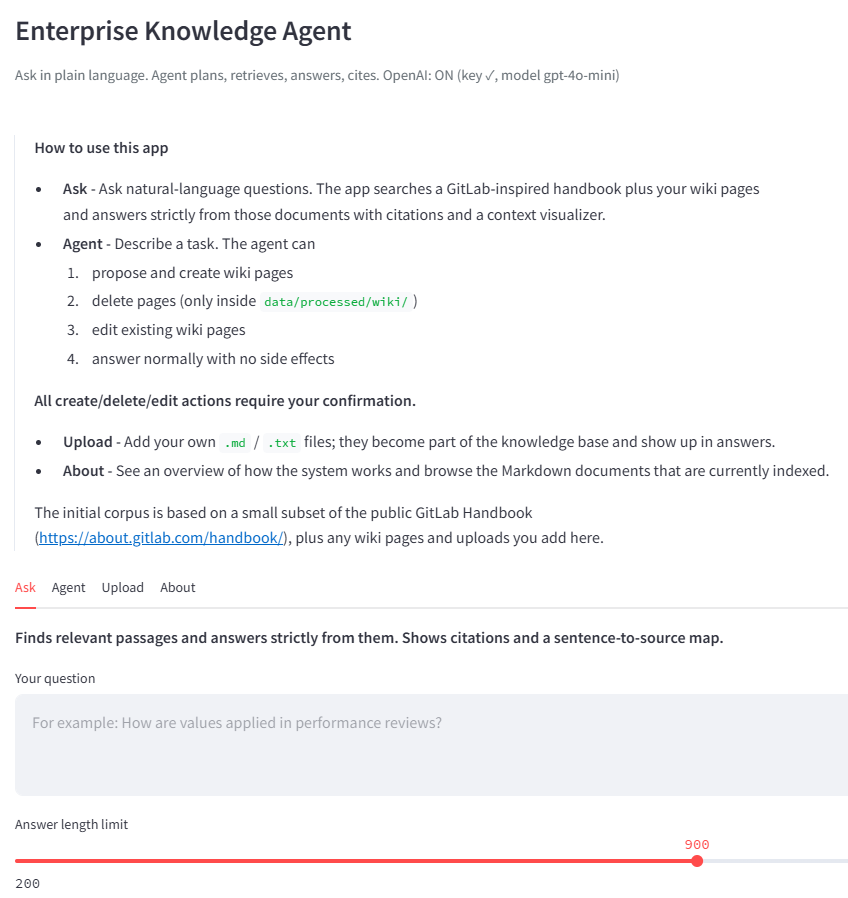
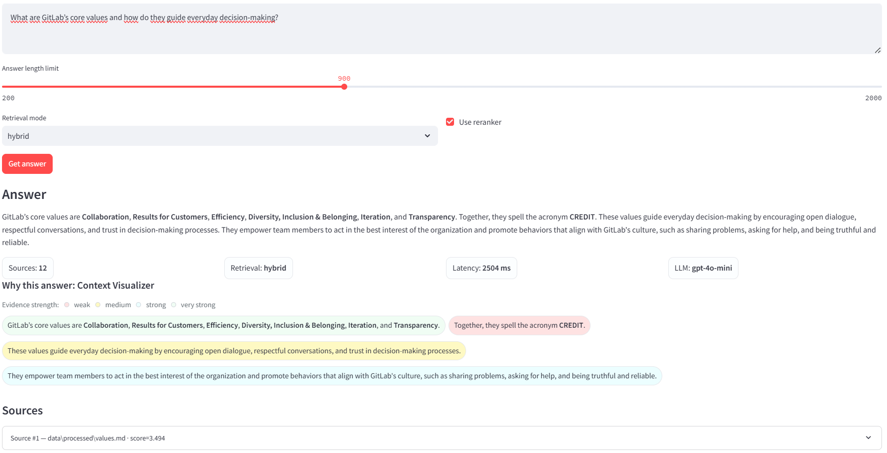
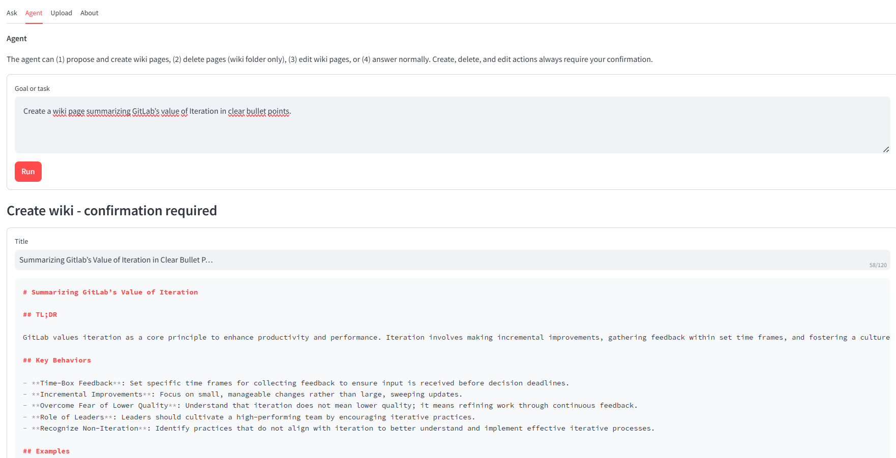

# Enterprise Knowledge Agent

[](LICENSE)

[](#)
[](https://github.com/ingo-stallknecht/enterprise-knowledge-agent/actions/workflows/ci.yml)
[](https://enterprise-knowledge-agent-5bjn6zbkntfrmnhlmanfn8.streamlit.app/)


---

## Overview

The **Enterprise Knowledge Agent (EKA)** is a Retrieval-Augmented Generation (RAG) and knowledge-editing system.
It ingests Markdown documents, builds semantic search using embeddings and FAISS, answers questions with citations, and provides safe tools to create or edit internal wiki pages.

The system runs:

- **Locally:** full functionality (wiki edits, incremental indexing, MLflow, Airflow)
- **Streamlit Cloud:** fully functional RAG + wiki-editing in safe mode (no MLflow/Airflow)

### Corpus Source

The system uses the structure and writing style of the publicly available [GitLab Handbook](https://about.gitlab.com/handbook/) as an inspiration and example of large-scale organizational documentation.

---

## UI Preview


---

## Retrieval-Augmented Q&A

- Embeds questions using MiniLM
- Retrieves relevant chunks using FAISS
- Optional reranking
- Answers via GPT-4o (if available) or extractive fallback
- Includes sentence-to-source attribution and expandable citation previews



---

## Agent Capabilities

The Agent can:

1. Create new wiki pages
2. Edit existing pages
3. Delete pages
4. Answer normally when no action is intended

Safeguards:

- All changes require confirmation
- All edits restricted to `data/processed/wiki/`
- Harmful content and unsafe titles are blocked
- Index updates incrementally



---

## Incremental Indexing

The system maintains a vector cache that enables:

- Fast re-embedding of only changed files
- Efficient deletion of vectors
- Lightweight rebuilds of the FAISS index
- Support for prebuilt indexes for instant cold starts

---

## Local vs Cloud

| Feature | Local | Streamlit Cloud |
|--------|-------|------------------|
| Ask (RAG) | ✓ | ✓ |
| Create/Edit/Delete wiki | ✓ | ✓ (safe mode) |
| Upload documents | ✓ | ✓ |
| Incremental indexing | ✓ | ✓ |
| MLflow tracking | ✓ | – |
| Airflow weekly updates | ✓ | – |

---

## MLflow Tracking (Optional, Local)

The system includes a lightweight evaluation + promotion workflow to ensure retrieval quality improves over time. All evaluation runs log metrics, parameters, and artifacts to a local MLflow file backend (`./mlruns`).

### What gets logged
- Retrieval metrics: Hit Rate, Precision@K, MRR
- Evaluation inputs and detailed Top-K sources
- Index/docstore versions and snapshots
- Promotion or rollback decisions
- Production pointers (`production_paths.json`) and full history

This creates a reproducible record of how each index version performs.

### Promotion Logic
After running the evaluation script, the promotion script compares the new metrics
against quality thresholds defined in `settings.yaml`. If the candidate index
meets or exceeds all thresholds, it is promoted by:

- Creating a versioned snapshot under `data/index/prod_snapshot_*`
- Updating the production pointer
- Appending to `history.json` (full index lineage)
- Logging the promotion event to MLflow

If thresholds fail, production remains unchanged.  
At any time you can run `--mode rollback` to restore the previous snapshot, which
updates only the pointer—no data is deleted.

This workflow acts as a simple CI/CD gate for RAG quality, ensuring that
index updates are safe, trackable, and reversible.

## Airflow Weekly Pipeline (Optional, Local)

The DAG `airflow/dags/weekly_ingest_and_train.py` automates:

- Fetching new GitLab Handbook pages
- Rebuilding the index
- Evaluating retrieval quality
- Promoting or rolling back based on metrics

## Enabling GPT Locally (Optional)

To use GPT-powered answers and wiki drafting, create a .env file in the repo root:

.env is not tracked by Git (it’s in .gitignore).
Don’t commit your real API key.

Create enterprise-knowledge-agent/.env with e.g.:
```txt
# Enable OpenAI usage
USE_OPENAI=true
OPENAI_API_KEY=sk-...your-key-here...

# Model and generation settings
OPENAI_MODEL=gpt-4o-mini
OPENAI_MAX_INPUT_TOKENS=6000
OPENAI_MAX_OUTPUT_TOKENS=400
OPENAI_TEMPERATURE=0.2

# Local daily cost guard (USD, approximate)
OPENAI_MAX_DAILY_USD=0.80
```
---

## Quickstart (Local)

```bash
git clone https://github.com/ingo-stallknecht/enterprise-knowledge-agent.git
cd enterprise-knowledge-agent
pip install -r requirements.txt
streamlit run app/streamlit_app.py
```

## Optional (development tools)

```bash
pip install -r requirements-dev.txt
bash mlflow/start_mlflow.sh
docker-compose -f docker-compose.yml up
```
